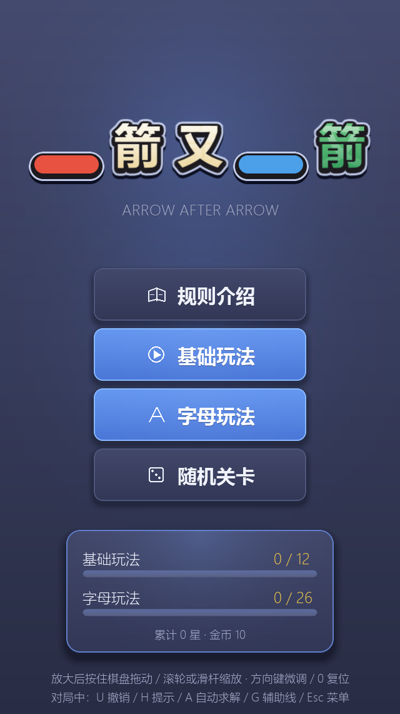
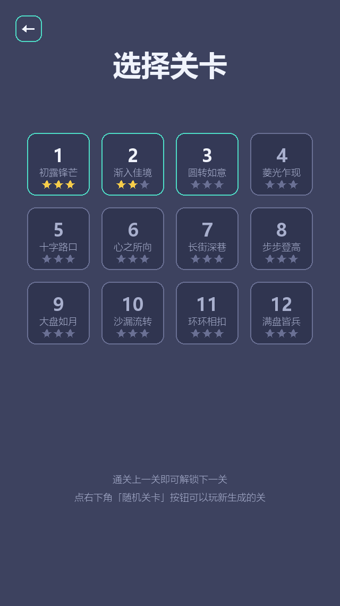
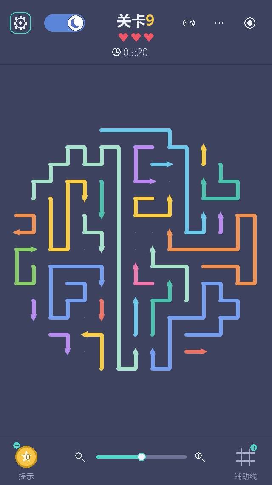
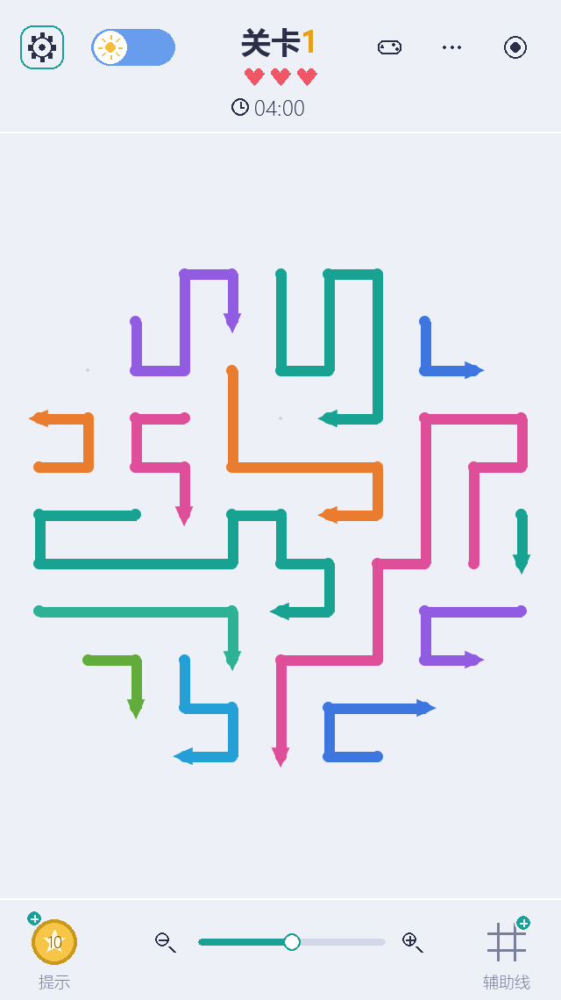
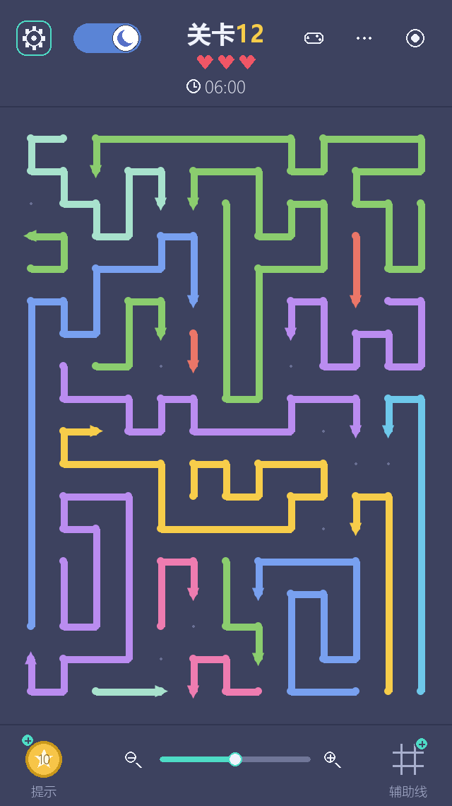
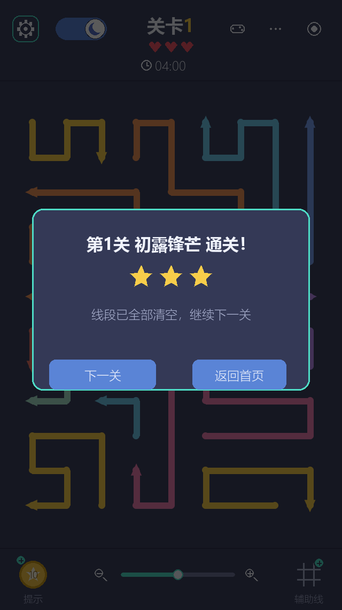
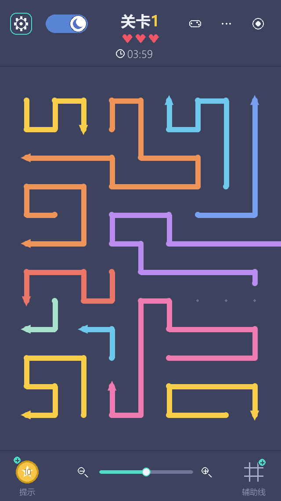
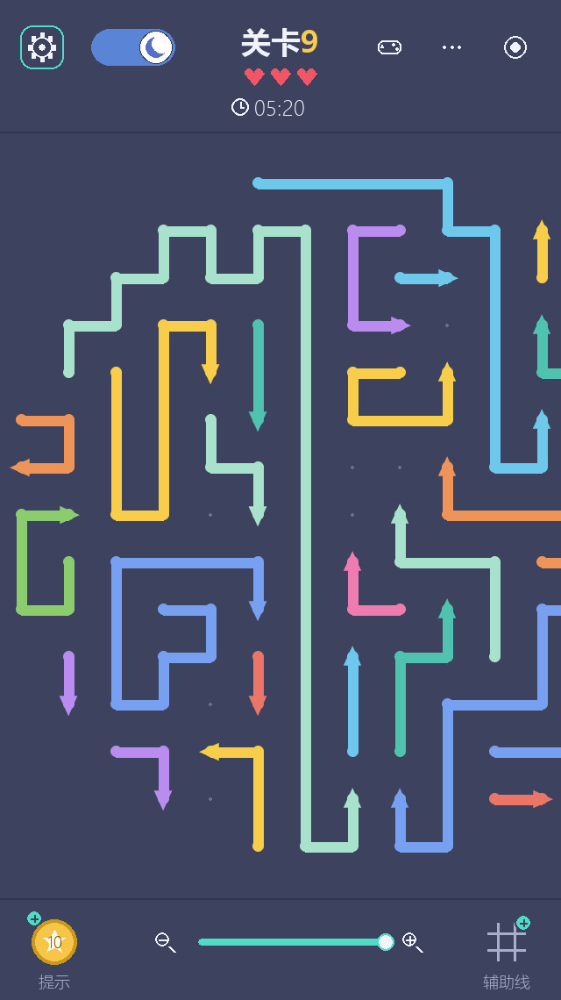

# 一箭又一箭（Arrow After Arrow）

一个用 Python + Pygame 手写实现的益智小游戏，界面与玩法对齐微信小游戏《一箭又一箭》：
棋盘被裁成一个造型（圆 / 菱形 / 心 / 沙漏……），里面密密麻麻塞满彩色的**折线箭**。
点击一条线段，它会沿自己的折线轨迹滑出棋盘、再顺箭头方向飞出屏幕；如果箭头前方被
别的线段挡住，则被弹回、扣一颗红心。清空全部线段即通关，红心耗尽或倒计时归零则失败。

## 开发环境

- 操作系统：Windows
- Python：3.14
- pygame-ce 2.5.x（导入名仍为 `pygame`，API 与 pygame 2.x 兼容）
- pytest 9.x（单元测试）

> 说明：Python 3.14 上官方 pygame 暂无预编译安装包，直接 `pip install pygame` 会尝试本地源码
> 编译并报错（`No module named 'setuptools._distutils.msvccompiler'`），因此本项目使用社区版
> **pygame-ce**，安装包名不同但代码里照常 `import pygame`。

## 安装与运行

```bash
pip install -r requirements.txt
python main.py
```

## 操作说明

| 操作 | 效果 |
|---|---|
| 左键点击线段 | 能飞出则整条滑出并消失；被挡住则弹回并扣一颗红心（按下后位移不超过 8 像素才算点击） |
| 左键拖动棋盘 | 放大到超出可视区后，按住棋盘拖动即可平移（按住线段拖也不算点错） |
| 中键 / 右键拖动 | 任何时候都能拖动棋盘 |
| 滚轮 | 缩放棋盘，锚在鼠标指的位置上 |
| 方向键 / `+` `-` / `0` | 平移微调 / 缩放 / 复位视图 |
| 左键点击空格 | 无惩罚 |
| 顶部齿轮 | 打开设置（音效、重置进度） |
| 顶部拨杆 | 日间 / 夜间主题切换，立即生效并存档 |
| 顶部手柄 / `⋯` / 靶心 | 跳过关卡（3 金币）/ 游戏菜单 / 关卡选择 |
| 底部金币 | 花 1 金币点亮「现在该点哪一支」 |
| 底部滑杆与放大镜 | 缩放棋盘 |
| 底部 `#` | 辅助线点阵开关 |
| 拖拽窗口边框 | 整幅画面等比缩放（窗口尺寸、棋盘几何都跟着变） |
| 快捷键 | `U` 撤销 · `H` 提示 · `A` AI 自动求解 · `G` 辅助线 · `N` 随机关卡 · `Esc` 菜单与返回 |

> 棋盘只在放大到超出可视区时才拖得动（缩小状态下本来就整块看得见，位置锁在正中）。
> 拖动被夹在可视区里：最多拖到棋盘边缘与可视区边缘对齐，绝不会把棋盘拖出屏幕找不回来。

## 玩法与关卡

- **12 个主线关卡**，造型依次为方形、圆形、菱形、十字、心形、三角、沙漏、圆环等。
- 关卡不是手摆的，而是由 `game/generator.py` 用**逆向构造法**批量生成，
  每一关都要过两道独立校验：按生成顺序模拟点一遍，再用求解器独立解一遍。
- **关卡是互相阻挡的**：一支箭的箭头常常直接顶在另一支箭的身体上，必须先清掉
  挡路的那支。难度逐关递增 —— 开局能直接点掉的箭从第 1 关的 67% 降到第 12 关
  的 11%（19 支箭里只有 2 支能直接点）。
- 盘面填充率普遍在 **0.94 ~ 1.00**（参考录屏里的盘面几乎铺满，空出来的点阵就是箭的飞行通道）。
- **随机关卡**：按 `N` 或从菜单点「随机关卡」，用同一套生成器现场生成一关，不写入存档进度。
- **AI 求解**：`game/solver.py` 把「谁挡谁」建成有向图做**拓扑排序**，O(n²) 精确判定，
  既能给出下一步提示（H），也能自动替你通关（A）；图里有环才判为无解。
- **飞出动画**：整条线沿自身折线「流」出去 —— 取的是折线真正的一段（拐角不会被两点间的
  斜弦切掉），直段画实心矩形、只有拐角与两端补圆点，圆点与箭头用 4 倍超采样做抗锯齿；
  单帧步进夹了 50 ms 上限，切窗口回来也不会「瞬移」。详见 `docs/design.md` 第 7 节。

## 项目结构

```text
arrow-after-arrow/
├── main.py                    # 游戏入口：主循环、状态机、输入、绘制
├── game/
│   ├── settings.py            # 全局配置：窗口尺寸、布局、线宽、两套箭头调色板
│   ├── theme.py               # 日间 / 夜间两套界面配色 + 箭头配色解析
│   ├── arrow.py               # 方向枚举、线段宽度、圆角折线与箭头绘制
│   ├── shapes.py              # 关卡造型遮罩：矩/圆/菱/心/三角/十字/沙漏/环
│   ├── generator.py           # 逆向构造法关卡生成器 + 通关校验 + 阻挡难度旋钮
│   ├── level.py               # 12 关关卡数据（由 tools/generate_levels.py 生成）
│   ├── board.py               # 棋盘：占据网格、射线检测、撤销、重置
│   ├── solver.py              # 拓扑排序求解器：提示 / 自动通关共用
│   ├── animations.py          # 飞出滑行（沿折线取段）、残影、弹回摆动、提示呼吸
│   ├── hud.py                 # 顶栏 / 底栏控件
│   ├── icons.py               # 全部图标都是代码画的矢量图，无图片素材
│   ├── ui.py                  # 按钮、图标按钮、日夜拨杆、滑杆、菜单面板
│   ├── audio.py               # 程序合成音效（不依赖任何音频素材）
│   ├── storage.py             # JSON 存档：进度、星级、金币、设置
│   └── states.py              # 游戏状态枚举
├── tools/
│   ├── generate_levels.py     # 重新生成 game/level.py（支持单关重生成与 --check）
│   └── screenshot.py          # 无窗口离屏渲染，批量导出 assets/screenshots/
├── tests/                     # pytest：路径 / 生成器 / 阻挡 / 求解器 / 存档 / 窗口 / 缩放拖动 / 动效 / 端到端
├── docs/
│   ├── design.md              # 设计说明：数据结构、算法、界面布局、动效
│   └── test-record.md         # T01–T10 测试记录
├── assets/screenshots/        # 游戏截图
├── AIGC记录.md                # AIGC 使用记录
├── requirements.txt
└── .gitignore
```

## 测试与工具

```bash
python -m pytest -q                    # 150 个用例，无窗口运行
python tools/generate_levels.py        # 重新生成 12 关
python tools/generate_levels.py --check  # 校验现有 level.py：可通、可解、有阻挡
python tools/generate_levels.py --stats  # 打印 12 关的难度表
python tools/screenshot.py             # 重新导出 README 用的截图
```

## 游戏截图

| 开始界面 | 关卡选择 |
|---|---|
|  |  |

| 夜间关卡 | 日间关卡 |
|---|---|
|  |  |

| 大关铺满 | 通关结算 |
|---|---|
|  |  |

| 飞行中的一帧（线正沿自身折线滑出，尾迹逐格点亮） | 放大后拖到一侧（可见区只剩棋盘的一部分） |
|---|---|
|  |  |
